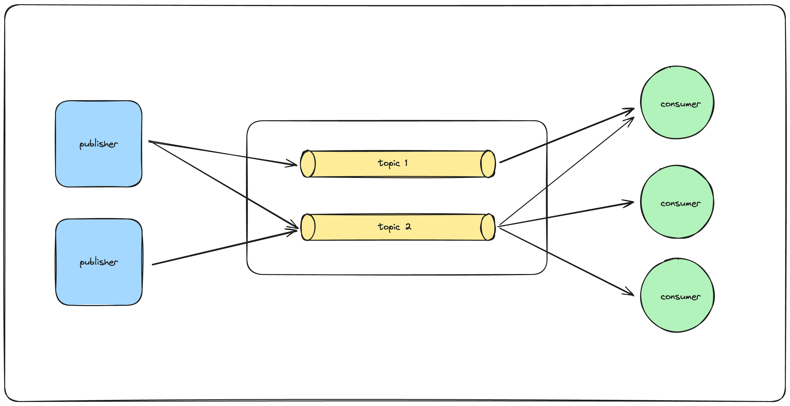

# PubSub: A Simple Publish/Subscribe Messaging Library for Go

PubSub is a Go library that implements a simple, stateless publish-subscribe messaging platform using gRPC. It allows you to create brokers, consumers, and publishers to send and receive messages across different components in your distributed systems.



## Features

- **gRPC-based communication:** Leverages gRPC for efficient and language-agnostic communication.
- **Simple API:** Provides straightforward functions for publishing and subscribing to topics.
- **Lightweight & Fast:** Minimal overhead and efficient message routing.

## Components

- **Broker:**

  - Acts as the central hub for message routing.
  - Manages topic subscriptions and delivers messages to relevant subscribers.
  - Automatically handles dead listeners and cleans up stale subscriptions.
  - Provides gRPC endpoints for publishing and subscribing.

- **Consumer:**

  - Subscribes to one or more topics.
  - Exposes a channel to consume the recived messages from.

- **Publisher:**
  - Publishes messages to specific topics.

## Getting Started

### Set up

#### Generate the gRPC stubs

```bash
# Install protoc
brew install protobuf

# Install grpc dependencies
go install google.golang.org/protobuf/cmd/protoc-gen-go@latest

go install google.golang.org/grpc/cmd/protoc-gen-go-grpc@latest

# Generate stubs
chmod +x ./pkg/grpcapi/build.sh && ./pkg/grpcapi/build.sh
```

#### Install the Go Dependencies

```bash
go mod download
```

### Start the broker

```go
broker := pubsub.NewBroker(":50051") // Example port
if err := broker.Start(); err != nil {
   // Handle error
}
```

### Create a consumer

```go
consumer, err := pubsub.NewConsumer("localhost:50051") // Broker address
if err != nil {
   // Handle error
}
defer consumer.Close()

if err := consumer.Subscribe("myTopic"); err != nil {
   // Handle error
}

for msg := range consumer.Messages {
   fmt.Println("Received message:", msg.Message)
}
```

### Create a publisher

```go
publisher, err := pubsub.NewPublisher("localhost:50051") // Broker address
if err != nil {
    // Handle error
}
defer publisher.Close()

if err := publisher.Publish("myTopic", []byte("Hello from publisher!")); err != nil {
    // Handle error
}
```

## Example Usage

Refer to the `testing` directory within the repository for more detailed usage scenarios.

## Contributing

Contributions to improve and extend PubSub are welcome! Please follow the contribution guidelines outlined in the repository.

## License

PubSub is released under the MIT License
